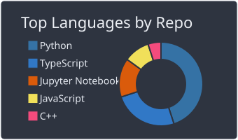
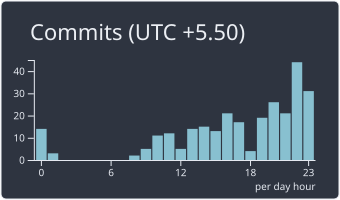
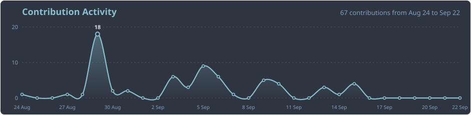
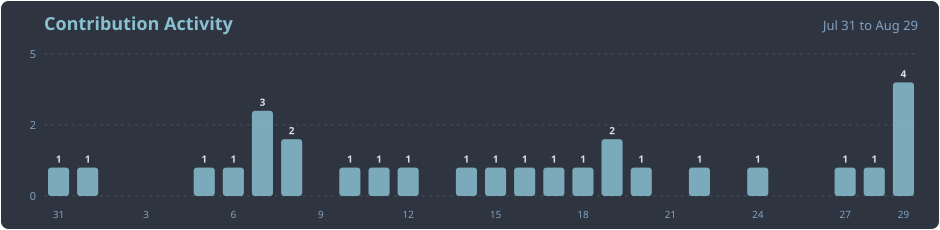

# Vinay Saunshi

Developer, Problem Solver, Automation

I enjoy building clean, efficient and impactful solutions that solve real problems.

## Tools and tech I have worked on

<table width="100%">
  <tr>
    <th align="left" width="25%">Languages</th>
    <th align="left" width="25%">Frontend</th>
    <th align="left" width="25%">Backend</th>
    <th align="left" width="25%">Database</th>
  </tr>
  <tr>
    <td align="left"></td>
    <td align="left"></td>
    <td align="left"></td>
    <td align="left"></td>
  </tr>
  <tr>
    <th align="left">Cloud &amp; Hosting</th>
    <th align="left" colspan="3">AI &amp; ML</th>
  </tr>
  <tr>
    <td align="left"></td>
    <td align="left" colspan="3"></td>
  </tr>
  <tr>
    <th align="left">IDE</th>
    <th align="left">DevOps &amp; Automation</th>
    <th align="left">Design &amp; Tools</th>
    <th align="left">IOT</th>
  </tr>
  <tr>
    <td align="left"></td>
    <td align="left"></td>
    <td align="left"></td>
    <td align="left"></td>
  </tr>
</table>

## GitHub Stats

<table>
  <tr>
    <td align="left" valign="top" colspan="3"></td>
    <td align="left" valign="top" colspan="3"></td>
  </tr>
  <tr>
    <td align="left" valign="top" colspan="2"></td>
    <td align="left" valign="top" colspan="2"></td>
    <td align="left" valign="top" colspan="2"></td>
  </tr>
</table>

## Contribution Graph

  
<b>Last year</b>

  

  
<b>Last 30 days</b>

  

