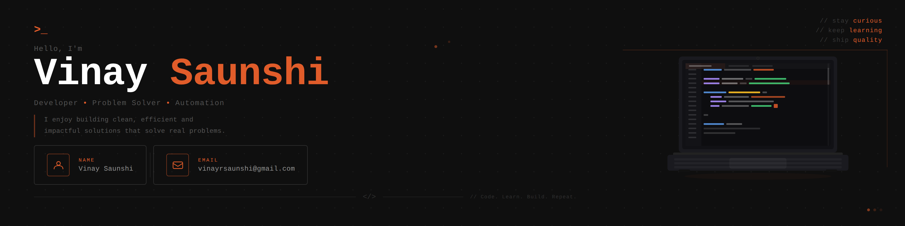

  

## ⚡ Tools and tech I have worked on

<table style="width:100%; border-collapse:collapse;">
  <tr>
    <th style="text-align:left; margin-right:5px;">Languages</th>
    <th style="text-align:left; margin-right:5px;">Frontend</th>
    <th style="text-align:left; margin-right:5px;">Backend</th>
    <th style="text-align:left; margin-right:5px;">Database</th>
  </tr>
  <tr>
    <td style="text-align:left; margin-right:5px;">
      
    </td>
    <td style="text-align:left; margin-right:5px;">
      
    </td>
    <td style="text-align:left; margin-right:5px;">
      
    </td>
    <td style="text-align:left; margin-right:5px;">
      
    </td>
  </tr>

  <tr>
    <th style="text-align:left; margin-right:5px;">Cloud & Hosting</th>
    <th style="text-align:left; margin-right:5px;" colspan="3">AI & ML</th>
  </tr>
  <tr>
      <td style="text-align:left; margin-right:5px;">
          
      </td>
      <td style="text-align:left; margin-right:5px;" colspan="3">
          
      </td>
  </tr>

  <tr>
    <th style="text-align:left; margin-right:5px;">IDE</th>
    <th style="text-align:left; margin-right:5px;">DevOps & Automation</th>
    <th style="text-align:left; margin-right:5px;">Design & Tools</th>
    <th style="text-align:left; margin-right:5px;">IOT</th>
  </tr>
  <tr>
    <td style="text-align:left; margin-right:5px;">
      
    </td>
    <td style="text-align:left; margin-right:5px;">
      
    </td>
    <td style="text-align:left; margin-right:5px;">
      
    </td>
    <td style="text-align:left;">
        
    </td>
  </tr>
</table>

## 📊 GitHub Stats

<table width="100%">
  <tr>
    <td colspan="3">
      
    </td>
  </tr>

  <tr>
    <td width="40%" align="center">
      
    </td>
    <td width="35%" align="center">
      
    </td>
    <td width="25%" align="center">
      
    </td>
  </tr>
</table>

## 👦🏻 Profiles

